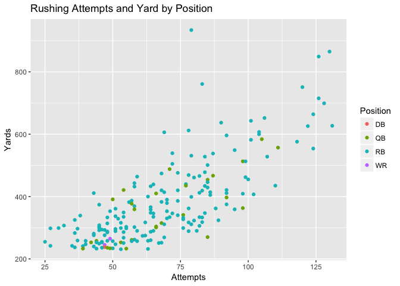

## What this is:
Test text

## Where it is going:
I plan to use this blog to post about topics that I am studying in political science. I am excited that I can use this website to easily write short responses, use LaTeX to write math equations, and post findings from my data science work in R.

## LaTeX comments:
I am using [kramdown](https://kramdown.gettalong.org/syntax.html#math-blocks), based on Markdown, to write in LaTeX. The below equation is an example pulled from the kramdown webpage:

	 

<!-- -->

